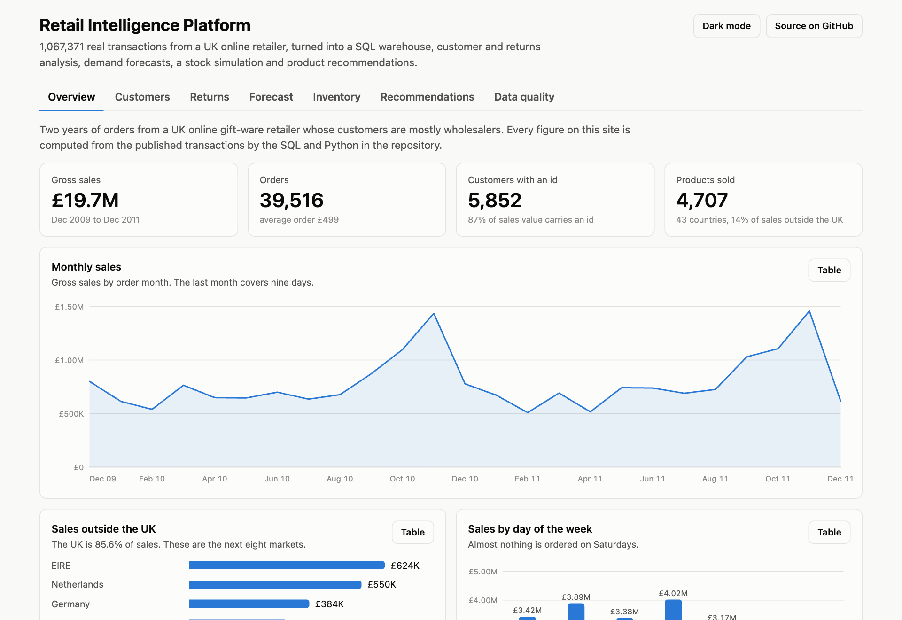
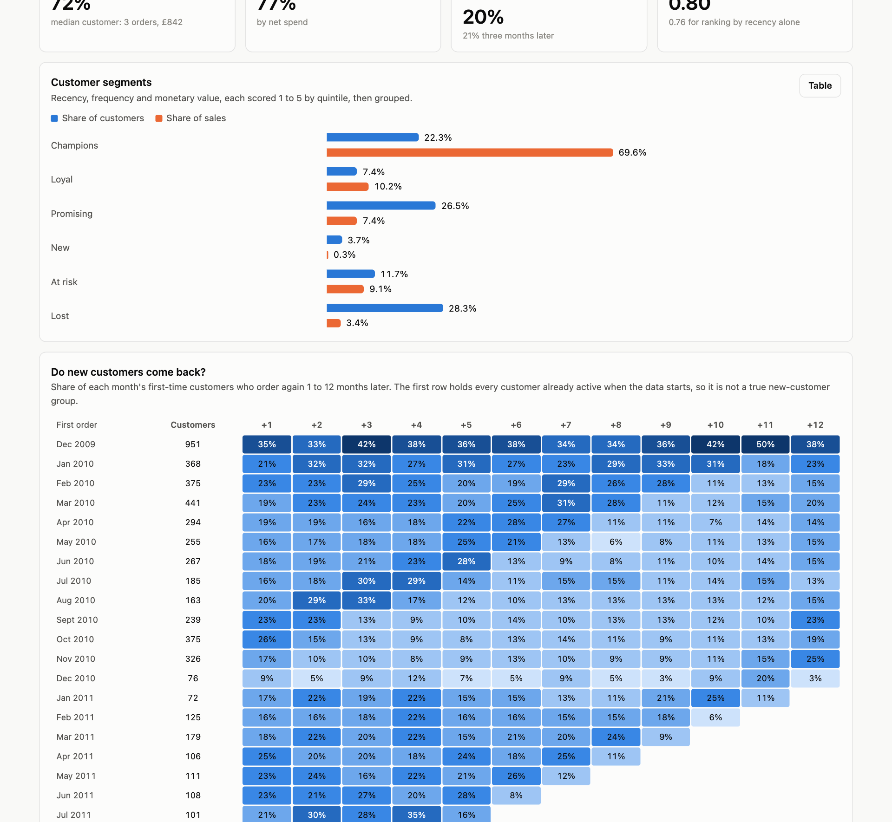
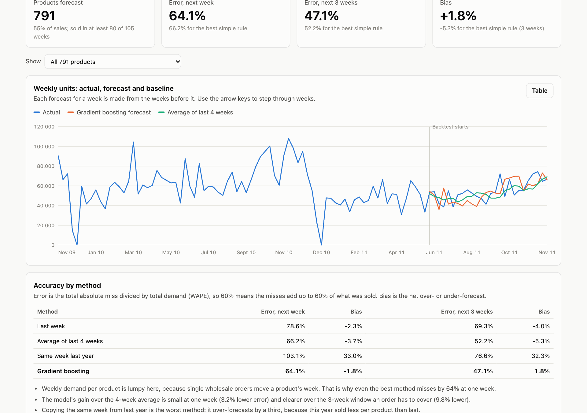
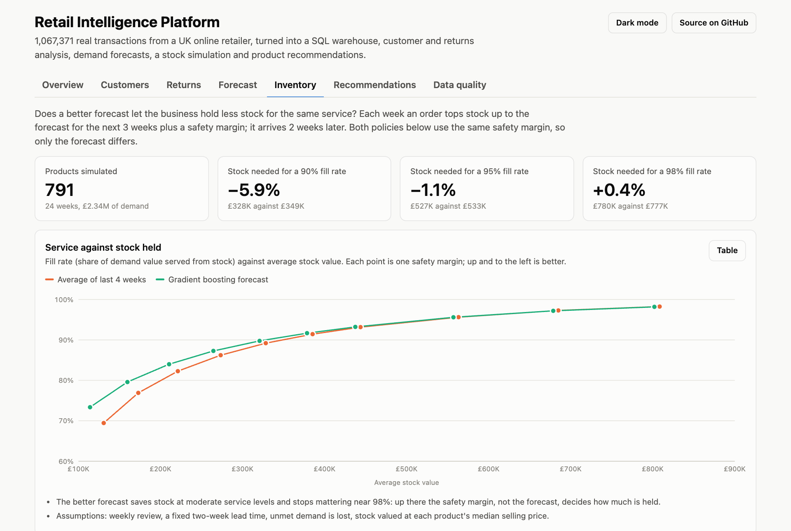
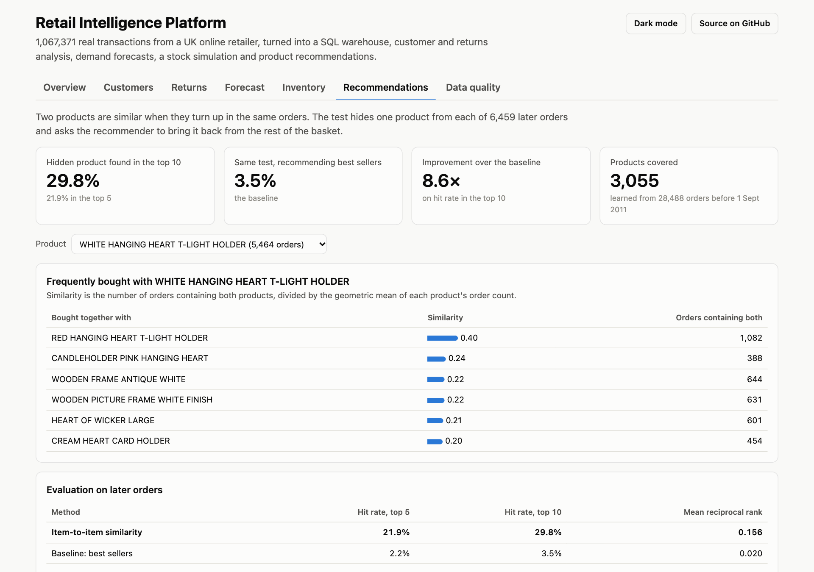

# Retail Intelligence Platform


One million real retail transactions turned into a SQL warehouse, customer and returns analysis, a repeat-purchase model, demand forecasts, a stock simulation and product recommendations, served by an API and a dashboard.

**Live demo:** https://s-harshni.github.io/Retail-Intelligence-Platform/



## The data

[Online Retail II](https://archive.ics.uci.edu/dataset/502/online+retail+ii) (UCI Machine Learning Repository, CC BY 4.0): every invoice line of a UK-based online gift-ware retailer from 1 December 2009 to 9 December 2011. It is real data with real problems: nine days published twice, cancellations mixed in with sales, postage and fee lines, stock write-offs, a fifth of lines without a customer id, and two bulk orders of 81,000 and 74,000 units that were cancelled within minutes.

The converted file is in the repository ([`data/`](data/README.md)), so everything below can be reproduced without a download. Two runs of the pipeline produce byte-identical output.

## What it does

| Module | Question it answers | Code |
| --- | --- | --- |
| **Warehouse** | What is a sale, a return, a fee, a duplicate? | [`sql/`](sql) (DuckDB star schema, 12 quality checks) |
| **Sales and returns** | What sells, where, when, and what comes back? | [`analytics.py`](src/retail/analytics.py) |
| **Customers** | Who are the valuable customers, and do new ones return? | RFM segments and monthly cohorts in [`04_marts.sql`](sql/04_marts.sql) |
| **Repeat-purchase model** | Who will order in the next 90 days? | [`customer_model.py`](src/retail/customer_model.py) |
| **Demand forecast** | How many units of each product next week, and over the next three? | [`forecasting.py`](src/retail/forecasting.py) |
| **Inventory** | Does the better forecast buy the same service with less stock? | [`inventory.py`](src/retail/inventory.py) |
| **Recommendations** | What is bought together with this product? | [`recommender.py`](src/retail/recommender.py) |
| **API** | Serve all of it over HTTP | [`api.py`](src/retail/api.py) (FastAPI) |

## Results

Every number is measured by `python -m retail.pipeline` and shown on the live dashboard. Models are compared with simple baselines and tested on data later than anything they were trained on.

### Warehouse and data quality

| | |
| --- | ---: |
| Rows in the source | 1,067,371 |
| Rows published twice and removed | 22,523 |
| Sales and return lines kept | 1,032,918 |
| Lines that are fees, postage, vouchers or stock adjustments | 11,930 |
| Sale lines later returned in full by the same customer | 6,208 |
| Quality checks passing on every build | 12 of 12 |

The checks include reconciliations (monthly and product revenue against the fact table, the duplicated week counted exactly once) as well as key and sign checks. The pipeline stops if any fails.

### Sales, returns and customers

- **Sales:** £19.7 million gross over 39,516 orders, 4,707 products and 43 countries; 85.6% is in the UK.
- **Returns:** 3.7% of sales value is returned. The products sent back most often are fragile ones (lights, cake stands, teapots).
- **Concentration:** the top 20% of customers account for 77% of sales. The "Champions" segment is 22% of customers and 70% of sales.
- **Retention:** about 20% of first-time customers order again the following month.



### Repeat-purchase model

Features describe each customer using only orders before a cut-off date; the label is whether they order in the following 90 days. The model is trained on four earlier cut-offs and tested on the last 90 days of the data (5,256 customers).

| Method | ROC AUC | Top 10% who ordered | Lift |
| --- | ---: | ---: | ---: |
| Baseline: most recent buyers first | 0.763 | 78.1% | 1.79× |
| Baseline: most frequent buyers first | 0.747 | 87.6% | 2.01× |
| Logistic regression | 0.791 | 90.7% | 2.08× |
| **Gradient boosting** | **0.797** | **91.6%** | **2.10×** |

43.6% of all customers ordered in the test window. The ranking is useful; the raw probabilities run low, because the test window is the pre-Christmas peak and the model has seen only one earlier autumn.

### Demand forecast

One gradient-boosting model forecasts weekly units for 791 regularly selling products (55% of sales). It is backtested on the last 26 weeks with a rolling origin, refitted every 4 weeks, and every feature of a week is built only from earlier weeks (a test enforces this).

| Method | Error, next week | Error, next 3 weeks | Bias (3 weeks) |
| --- | ---: | ---: | ---: |
| Last week | 78.6% | 69.3% | −4.0% |
| Average of last 4 weeks | 66.2% | 52.2% | −5.3% |
| Same week last year | 103.1% | 76.6% | +32.3% |
| **Gradient boosting** | **64.1%** | **47.1%** | **+1.8%** |

Error is WAPE: total absolute miss over total demand. Product-level weekly demand is lumpy here, because one wholesale order can move a product's week, so every method misses by a lot. The model's gain over the best simple rule is small at one week (3% lower error) and clearer over the three weeks a replenishment order has to cover (10% lower, with the bias removed).



### Inventory simulation

A weekly order tops stock up to the forecast for the next three weeks plus a safety margin, with a two-week lead time. Both policies use the same safety margin, so only the forecast differs.

| Fill rate | Stock, model forecast | Stock, 4-week average | Difference |
| --- | ---: | ---: | ---: |
| 90% | £328K | £349K | −5.9% |
| 95% | £527K | £533K | −1.1% |
| 98% | £780K | £777K | +0.4% |

The better forecast saves stock at moderate service levels and makes no difference near 98%, where the safety margin decides how much is held. That is the honest size of the benefit on this data.



### Recommendations

Item-to-item cosine similarity over order baskets, built from orders before 1 September 2011 and tested on 6,459 later orders: one product is hidden from each basket and has to come back in the top k.

| Method | Hit rate, top 5 | Hit rate, top 10 |
| --- | ---: | ---: |
| Baseline: best sellers | 2.2% | 3.5% |
| **Item-to-item similarity** | **21.9%** | **29.8%** |



## Architecture

```
UCI workbook ──► Parquet ──► DuckDB warehouse ───────────────► analytics ─────────────┐
                              staging (clean, classify)        customer model         ├─► data.json ──► dashboard (GitHub Pages)
                              dimensions, fact_sales           demand forecast        │
                              marts (monthly, product,         inventory simulation   │
                              RFM, cohorts, weekly, baskets)   recommender ───────────┤
                              quality checks                         │                 │
                                                                     ▼                 │
                                                        model tables in DuckDB ──► FastAPI
```

Model outputs are written back into the warehouse (`ml_customer_score`, `ml_forecast`, `ml_item_neighbour`), so the API answers every request with plain SQL.

| Endpoint | Returns |
| --- | --- |
| `GET /kpis` | Sales, orders, return rate, customers |
| `GET /products?search=` | Product search |
| `GET /products/{code}` | Sales, return rate, latest forecasts, products bought together |
| `GET /customers/{id}` | Segment, RFM scores, probability of ordering in the next 90 days |
| `POST /recommendations` | Top-k products for a basket |

## Run it

```bash
make install       # virtual environment and dependencies
make pipeline      # builds the warehouse, runs the models, writes docs/data/data.json (about a minute)
make test          # 21 tests
make api           # http://127.0.0.1:8000/docs
make dashboard     # http://127.0.0.1:8080
```

## Tests

21 tests, run in CI with the linter:

- **Cleaning rules** on hand-made rows: line classification, the duplicated sheet, one-to-one matching of reversed orders.
- **Invariants on the real data:** row counts, reconciliations, RFM score ranges, cohort arithmetic.
- **No look-ahead:** changing future weeks leaves a week's forecast features unchanged; customer features stop at the cut-off.
- **Models:** each beats its baseline; the stock simulation serves all demand with a perfect forecast and none with an empty one.
- **API:** every endpoint, including unknown ids and invalid input.

## Limitations

- One retailer, two years, mostly wholesale customers: results will not transfer to a supermarket or a fashion store.
- With two years of data the forecaster sees each season only once or twice, and the customer model is not calibrated across seasons.
- The stock simulation assumes a fixed two-week lead time, weekly review and lost sales, and values stock at selling price; real lead times and costs are not in the data.
- Recommendations are evaluated offline by hiding a product; that measures co-purchase, not whether a suggestion would change what a customer buys.
- 13% of sales value has no customer id and is left out of customer analysis.
- Results come from one random seed.

## Author

[S Harshni](https://github.com/S-Harshni)

Data: Chen, D. (2012). *Online Retail II* [Dataset]. UCI Machine Learning Repository. https://doi.org/10.24432/C5CG6D (CC BY 4.0).
